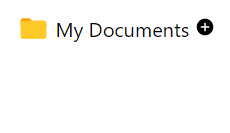
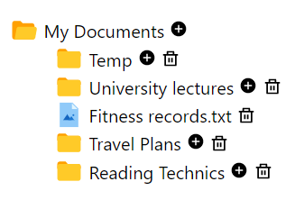
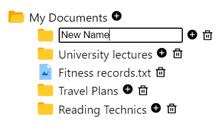
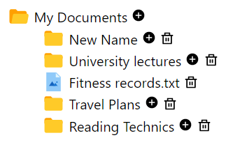
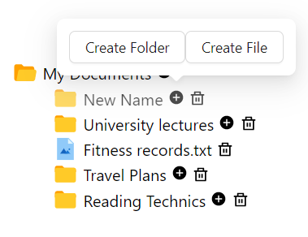
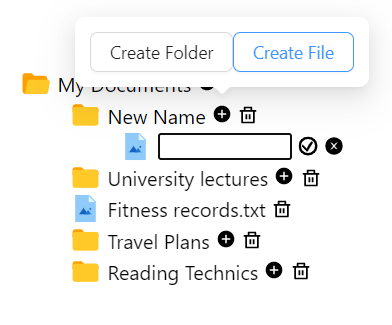

# Getting Started with Create React App

This project was bootstrapped with [Create React App](https://github.com/facebook/create-react-app), using the [Redux](https://redux.js.org/) and [Redux Toolkit](https://redux-toolkit.js.org/) TS template.

In order to start this project locally, you have to:
1. Install nodeJs on you machine
2. Install all needed dependencies by running `npm install` from project's root location
3. Run `npm run start-server`
4. Run `npm start`

## Available Scripts

In the project directory, you can run:

### `npm start`

Runs the app in the development mode.\
Open [http://localhost:3001](http://localhost:3000) to view it in the browser.

The page will reload if you make edits.\
You will also see any lint errors in the console.

### `npm run start-server`

Runs the mocked backend.\
Open [http://localhost:3000/items](http://localhost:3000) to view it in the browser.

This server references to `db.json` file as `DB`.\
Any actions (DELETE, UPDATE, CREATE) change the `db.json`\
file content, so, you can follow instructions from the\
terminal where `npm start-server` was called to create a \
snapshot of initial data in case you need it.

### `npm test`

Launches the test runner in the interactive watch mode.\
See the section about [running tests](https://facebook.github.io/create-react-app/docs/running-tests) for more information.

### `npm run build`

Builds the app for production to the `build` folder.\
It correctly bundles React in production mode and optimizes the build for the best performance.

The build is minified and the filenames include the hashes.\
Your app is ready to be deployed!

See the section about [deployment](https://facebook.github.io/create-react-app/docs/deployment) for more information.

### `npm run eject`

**Note: this is a one-way operation. Once you `eject`, you can’t go back!**

If you aren’t satisfied with the build tool and configuration choices, you can `eject` at any time. This command will remove the single build dependency from your project.

Instead, it will copy all the configuration files and the transitive dependencies (webpack, Babel, ESLint, etc) right into your project so you have full control over them. All of the commands except `eject` will still work, but they will point to the copied scripts so you can tweak them. At this point you’re on your own.

You don’t have to ever use `eject`. The curated feature set is suitable for small and middle deployments, and you shouldn’t feel obligated to use this feature. However we understand that this tool wouldn’t be useful if you couldn’t customize it when you are ready for it.
## WIP
*There is [Work In Progress](https://github.com/EvgheniAnachii/simple-note-app/pull/2) on refactoring the current component into a reusable and generic one.

## Collapse/Expand
Folders in this app are collapsable.

## Screenshots of the app \

Initial view: \

Root folder expanded: \

Edit name of existing item Step 1: \

Edit name updated: \

Adding new Item Step 1: \

Adding new Item Step 2: \

